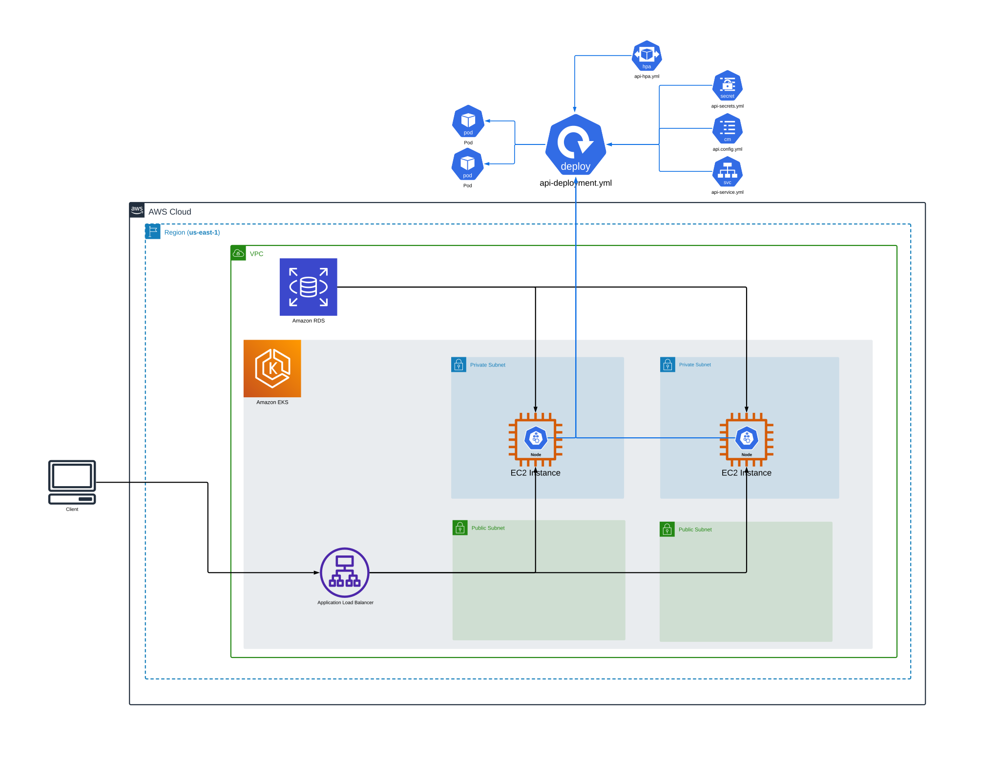
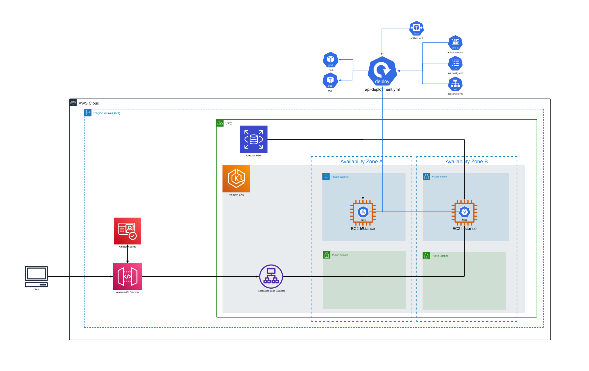

# Repositórios

## 1. **API Rest** (`api-rest`)

Este repositório contém a implementação de uma API RESTful para o gerenciamento de pedidos, desenvolvida utilizando as melhores práticas de design de software, incluindo **Domain-Driven Design (DDD)**, **Arquitetura Hexagonal**, **Clean Architecture** e padrões de projeto como **State Design Pattern**. A API está configurada para ser executada com Docker Compose.

## 2. **Kubernetes Infrastructure as Code** (`eks-iac`)

Este repositório contém a infraestrutura necessária para criar um cluster Kubernetes no Amazon EKS utilizando o Terraform. Ele automatiza o processo de provisionamento e configuração da infraestrutura na AWS, com arquivos separados para a configuração do cluster, nós e rede.

- **Estrutura**: Contém arquivos `.tf` para criação do cluster EKS, VPC e configuração dos nós.
- **Instruções de execução**: Execute o Terraform para inicializar, aplicar e destruir a infraestrutura.

## 3. **Database Infrastructure as Code**  (`rds-iac`)

Este repositório contém a configuração do Terraform para criar uma instância RDS e um grupo de sub-redes (subnet group) na AWS. A configuração cria um grupo de sub-redes privadas e uma instância de banco de dados dentro desse grupo de sub-redes.

## 4. **API Gateway Serverless** (`api-gateway`)

Este repositório contém a implementação de uma API Gateway Serverless na AWS utilizando o **Serverless Framework**. A API é configurada para ser usada como um proxy para redirecionar requisições para outros serviços e inclui um processo de autenticação integrado com o **Amazon Cognito**.

- **Estrutura**: Contém funções Lambda para autenticação de usuários, proxy e um autorizador customizado.
- **API Gateway**: Configurado com limites de requisições (10.000/mês) e throttling (200 simultâneas, 50 por segundo).
- **Cognito**: Integração com **UserPool**, **UserPoolClient** e **IdentityPool** para autenticação.
- **Requisitos**: Node.js 20.x, AWS CLI configurado e Serverless Framework instalado.
- **Comandos úteis**:
  - Para rodar localmente: `serverless offline start`
  - Para implantar na AWS: `serverless deploy`

---

Cada repositório foca em uma parte do projeto e pode ser utilizado de forma independente para gerenciar diferentes aspectos da infraestrutura e funcionalidade do sistema.

## Evolução de arquitetura AWS

  
   
  <em>Figura 1: Arquitetura AWS v1</em>

  
   
  <em>Figura 2: Arquitetura AWS v2</em>

